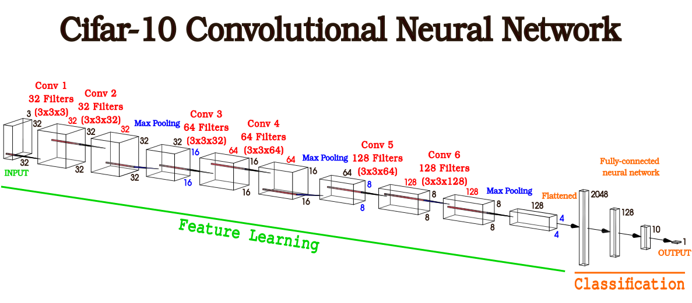

<!-- RESEARCH GROUP LOGO -->
 

  
  
  <h3 align="center">Entendiendo el funcionamiento de las Redes Neuronales Convolucionales</h3>

# Entendiendo el funcionamiento de las Redes Neuronales Convolucionales 

1. Objetivo

Comprender cómo operan los distintos componentes y procesos de una red neuronal convolucional tales como su arquitectura, dimensión de filtros, operaciones aritméticas, conformacion de los mapas de características (features maps) y los vínculos entre las diferentes capas. Para, de esta manera, poder diseñar y utilizarlas para procesar una imágen y detectar características de la misma con mayor conocimiento.

2. Introducción

Para poder entender las características de una red neuronal convolucional (CNN) resulta una buena idea comenzar por entender cómo operan sus componentes de forma simplificada para luego extrapolar este comportamiento al resto de la estructura. 

En este documento nos centraremos en la arquitectura de la Cifar-10 CNN provista por Jason Brownlee en su blog Machine Learning Mastery para poder llevar los conceptos teóricos a ejemplos prácticos que resulten fácilmente extrapolables a otros tipos de arquitecturas neuronales.  

